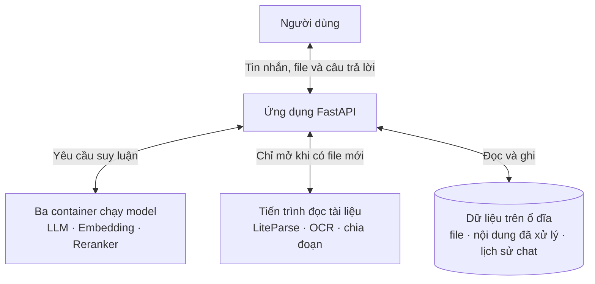
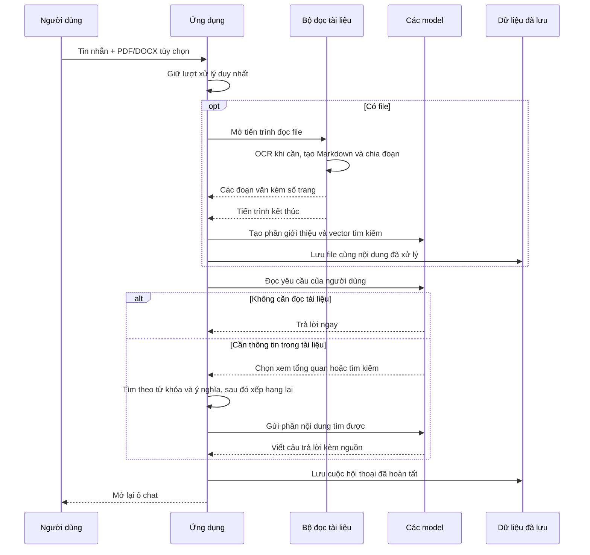

# Local RAG Chatbot

Chatbot RAG dành cho một máy cá nhân có GPU NVIDIA. Project giữ mọi thứ vừa đủ
cho nhu cầu sử dụng cá nhân: dễ cài, dễ theo dõi và không cần thêm dịch vụ ngoài.

## Kiến trúc

Trình duyệt chỉ làm việc với ứng dụng FastAPI. Ứng dụng nhận tin nhắn, quản lý
tài liệu, tìm nội dung liên quan và gửi yêu cầu đến ba model chạy bằng
[llama.cpp](https://github.com/ggml-org/llama.cpp). LLM, embedding và reranker nằm
trong ba Docker container riêng nên có thể khởi động, kiểm tra hoặc thay thế độc
lập.

Bộ đọc tài liệu không chạy thường trực. Khi người dùng tải PDF hoặc DOCX lên,
ứng dụng mới mở một tiến trình LiteParse để đọc file, OCR khi cần và chia văn bản
thành các đoạn nhỏ. Tiến trình này kết thúc ngay sau khi trả kết quả, nhờ đó tài
nguyên được hệ điều hành thu hồi hoàn toàn.



### Luồng upload và chat



LLM tự chọn cách xử lý. Hội thoại thông thường được trả lời ngay. Yêu cầu tóm tắt
hoặc lập dàn ý dùng phần giới thiệu đã lưu của tài liệu. Câu hỏi về dữ kiện cụ thể
sẽ tìm các đoạn liên quan rồi xếp hạng lại trước khi trả cho LLM. Sau khi file đã
sẵn sàng, phần trả lời cần một lượt gọi LLM, hoặc hai lượt nếu phải đọc tài liệu.

Trong lúc xử lý, ô chat được khóa để không có hai yêu cầu cùng sửa dữ liệu. Nút
Stop sẽ dừng phần việc đang chạy; nếu tiến trình đọc file còn hoạt động thì cả
nhóm tiến trình của nó cũng bị kết thúc. File chưa lưu xong sẽ bị bỏ, còn tài liệu
đã hoàn tất trước đó vẫn được giữ nguyên.

Project không cần parser chạy nền thường trực, hàng đợi tác vụ, vector database
hay agent framework. Torch và `llama-cpp-python` cũng không nằm trong ứng dụng
FastAPI.

## Phần cứng và nền tảng

Cấu hình tối thiểu mục tiêu:

- GPU NVIDIA có ít nhất **6 GB VRAM**;
- GPU có Tensor Core, khuyến nghị kiến trúc **Turing trở lên**;
- NVIDIA driver hỗ trợ **CUDA 13.0 trở lên**, kiểm tra bằng `nvidia-smi`;
- RAM hệ thống từ 16 GB;
- Python 3.12, [uv](https://docs.astral.sh/uv/), Docker Engine và Docker Compose.

Các tham số CUDA, Flash Attention, KV cache và MTP trong
[`docker-compose.yaml`](docker-compose.yaml) được tối ưu và kiểm thử trên GPU có
Tensor Core. Host không cần cài CUDA Toolkit; CUDA runtime nằm trong image
`ghcr.io/ggml-org/llama.cpp:server-cuda13`, còn driver host phải đủ mới để chạy
runtime đó.

Cấu hình tham chiếu đã kiểm thử bằng `inxi` và `nvidia-smi`:

- Fedora Linux 44 Workstation, kernel 7.1;
- Lenovo LOQ 15IRH8, Intel Core i5-13420H, RAM 16 GB;
- GeForce RTX 4050 Laptop GPU, 6141 MiB VRAM;
- NVIDIA driver 610.43.03, CUDA UMD 13.3.

### Linux

Cần [Docker Engine](https://docs.docker.com/engine/install/), NVIDIA driver và
[NVIDIA Container Toolkit](https://github.com/NVIDIA/nvidia-container-toolkit).
Không cần cài CUDA Toolkit trên host.

### Windows

Dùng Windows 10/11, WSL2 và Docker Desktop với WSL2 backend. Cài driver mới qua
[NVIDIA App](https://www.nvidia.com/en-us/software/nvidia-app/) rồi bật GPU support
trong [Docker Desktop](https://docs.docker.com/desktop/features/gpu/). Docker
Desktop cung cấp đường GPU vào Linux container qua WSL2; không cài riêng NVIDIA
Container Toolkit trong Windows.

## Model

Đặt bốn file sau trong `models/`:

| Vai trò | Hugging Face repository | File |
| --- | --- | --- |
| LLM QAT 4-bit | [`unsloth/gemma-4-E4B-it-qat-GGUF`](https://huggingface.co/unsloth/gemma-4-E4B-it-qat-GGUF) | `gemma-4-E4B-it-qat-UD-Q4_K_XL.gguf` |
| MTP drafter | cùng repository LLM | `mtp-gemma-4-E4B-it.gguf` |
| Embedding | [`gpustack/bge-m3-GGUF`](https://huggingface.co/gpustack/bge-m3-GGUF) | `bge-m3-Q8_0.gguf` |
| Reranker | [`gpustack/bge-reranker-v2-m3-GGUF`](https://huggingface.co/gpustack/bge-reranker-v2-m3-GGUF) | `bge-reranker-v2-m3-Q8_0.gguf` |

## Cài đặt

Các dependency hệ thống phục vụ chuyển đổi DOCX, render ảnh và OCR:

- [Tesseract OCR](https://github.com/tesseract-ocr/tesseract);
- [LibreOffice](https://github.com/LibreOffice/core);
- [ImageMagick](https://github.com/ImageMagick/ImageMagick).

Fedora/RHEL:

```bash
sudo dnf install -y tesseract tesseract-langpack-eng tesseract-langpack-vie libreoffice ImageMagick
```

Debian/Ubuntu:

```bash
sudo apt update
sudo apt install -y tesseract-ocr tesseract-ocr-eng tesseract-ocr-vie libreoffice imagemagick
```

Python và tokenizer:

```bash
uv sync --group dev
uv run python -c "from tokenizers import Tokenizer; Tokenizer.from_pretrained('BAAI/bge-m3')"
```

Model services:

```bash
docker compose up -d
curl -fsS http://127.0.0.1:8080/health
curl -fsS http://127.0.0.1:8081/health
curl -fsS http://127.0.0.1:8082/health
```

Application:

```bash
uv run python -m src.main
```

## Kiểm thử

```bash
uv run pytest -q
RUN_LIVE_MODEL_TEST=1 uv run pytest tests/test_agent_eval.py -m live_model -v -s
```
