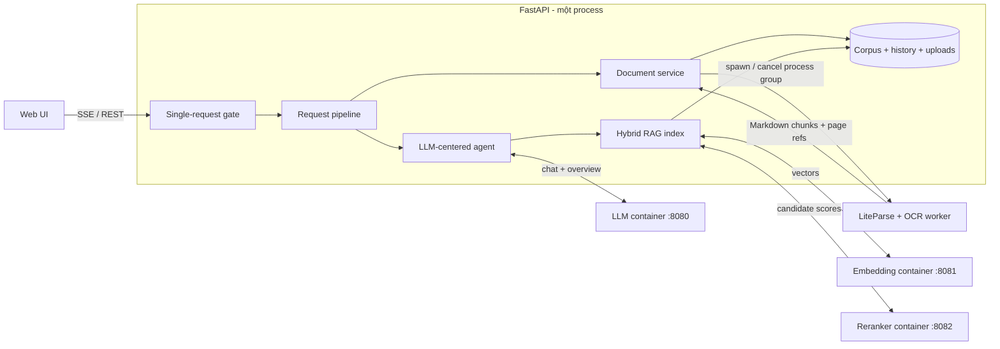
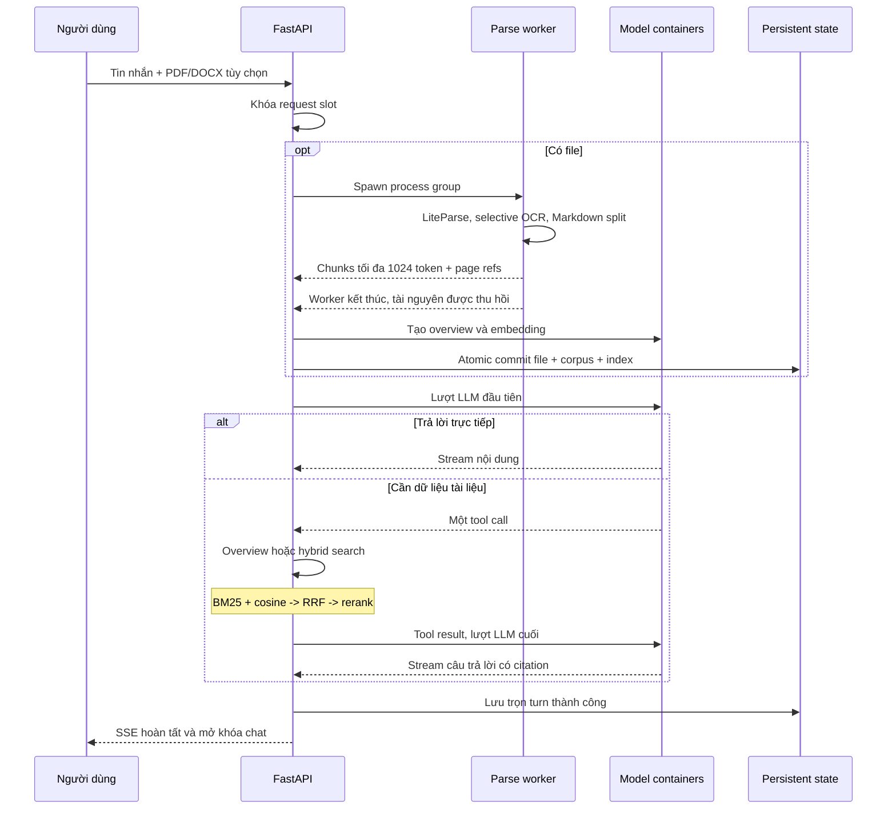

# Local RAG Chatbot

Pet project RAG chạy trên một máy cá nhân có GPU NVIDIA. Thiết kế ưu tiên ít
process, ít abstraction và không đưa model nặng vào web application.

## Kiến trúc

Hệ thống có bốn process chạy thường trực: một FastAPI process và ba
[llama.cpp](https://github.com/ggml-org/llama.cpp) CUDA container. Mỗi lần upload
tạo thêm đúng một LiteParse process group tạm thời; worker tự thoát sau khi parse
và chunk để hệ điều hành thu hồi toàn bộ tài nguyên của parser.



### Luồng upload và chat



Agent chỉ có hai công cụ: lấy overview để tóm tắt/dàn ý và hybrid search để tìm
dữ kiện chi tiết. Một request dùng tối đa hai lượt LLM. Stop hoặc client disconnect
sẽ hủy async task, gửi `SIGTERM` cho toàn bộ parser process group rồi nâng lên
`SIGKILL` nếu quá grace period. Dữ liệu chưa commit bị bỏ; dữ liệu đã atomic-commit
vẫn được giữ.

Không có parser daemon, task queue, vector database, agent framework, Torch hay
`llama-cpp-python` trong application process.

## Phần cứng và nền tảng

Cấu hình tối thiểu mục tiêu:

- GPU NVIDIA có ít nhất **6 GB VRAM**;
- GPU có Tensor Core, khuyến nghị kiến trúc **Turing trở lên**;
- NVIDIA driver hỗ trợ **CUDA 13.0 trở lên**, kiểm tra bằng `nvidia-smi`;
- RAM hệ thống từ 16 GB;
- Python 3.12, [uv](https://docs.astral.sh/uv/), Docker Engine và Docker Compose.

Các tham số CUDA, Flash Attention, KV cache và MTP trong
[`docker-compose.yaml`](docker-compose.yaml) được tối ưu và kiểm thử trên GPU có
Tensor Core. Host không cần cài CUDA Toolkit; CUDA runtime nằm trong image
`ghcr.io/ggml-org/llama.cpp:server-cuda13`, còn driver host phải đủ mới để chạy
runtime đó.

Cấu hình tham chiếu đã kiểm thử bằng `inxi` và `nvidia-smi`:

- Fedora Linux 44 Workstation, kernel 7.1;
- Lenovo LOQ 15IRH8, Intel Core i5-13420H, RAM 16 GB;
- GeForce RTX 4050 Laptop GPU, 6141 MiB VRAM;
- NVIDIA driver 610.43.03, CUDA UMD 13.3.

### Linux

Cần [Docker Engine](https://docs.docker.com/engine/install/), NVIDIA driver và
[NVIDIA Container Toolkit](https://github.com/NVIDIA/nvidia-container-toolkit).
Không cần cài CUDA Toolkit trên host.

### Windows

Dùng Windows 10/11, WSL2 và Docker Desktop với WSL2 backend. Cài driver mới qua
[NVIDIA App](https://www.nvidia.com/en-us/software/nvidia-app/) rồi bật GPU support
trong [Docker Desktop](https://docs.docker.com/desktop/features/gpu/). Docker
Desktop cung cấp đường GPU vào Linux container qua WSL2; không cài riêng NVIDIA
Container Toolkit trong Windows.

## Model

Đặt bốn file sau trong `models/`:

| Vai trò | Hugging Face repository | File |
| --- | --- | --- |
| LLM QAT 4-bit | [`unsloth/gemma-4-E4B-it-qat-GGUF`](https://huggingface.co/unsloth/gemma-4-E4B-it-qat-GGUF) | `gemma-4-E4B-it-qat-UD-Q4_K_XL.gguf` |
| MTP drafter | cùng repository LLM | `mtp-gemma-4-E4B-it.gguf` |
| Embedding | [`gpustack/bge-m3-GGUF`](https://huggingface.co/gpustack/bge-m3-GGUF) | `bge-m3-Q8_0.gguf` |
| Reranker | [`gpustack/bge-reranker-v2-m3-GGUF`](https://huggingface.co/gpustack/bge-reranker-v2-m3-GGUF) | `bge-reranker-v2-m3-Q8_0.gguf` |

## Cài đặt

Các dependency hệ thống phục vụ chuyển đổi DOCX, render ảnh và OCR:

- [Tesseract OCR](https://github.com/tesseract-ocr/tesseract);
- [LibreOffice](https://github.com/LibreOffice/core);
- [ImageMagick](https://github.com/ImageMagick/ImageMagick).

Fedora/RHEL:

```bash
sudo dnf install -y tesseract tesseract-langpack-eng tesseract-langpack-vie libreoffice ImageMagick
```

Debian/Ubuntu:

```bash
sudo apt update
sudo apt install -y tesseract-ocr tesseract-ocr-eng tesseract-ocr-vie libreoffice imagemagick
```

Python và tokenizer:

```bash
uv sync --group dev
uv run python -c "from tokenizers import Tokenizer; Tokenizer.from_pretrained('BAAI/bge-m3')"
```

Model services:

```bash
docker compose up -d
curl -fsS http://127.0.0.1:8080/health
curl -fsS http://127.0.0.1:8081/health
curl -fsS http://127.0.0.1:8082/health
```

Application:

```bash
uv run python -m src.main
```

## Kiểm thử

```bash
uv run pytest -q
RUN_LIVE_MODEL_TEST=1 uv run pytest tests/test_agent_eval.py -m live_model -v -s
```
