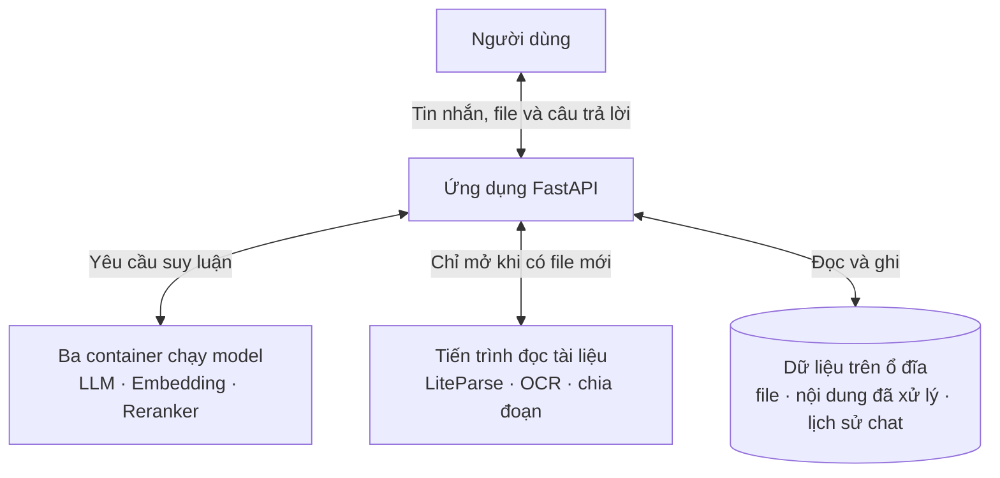
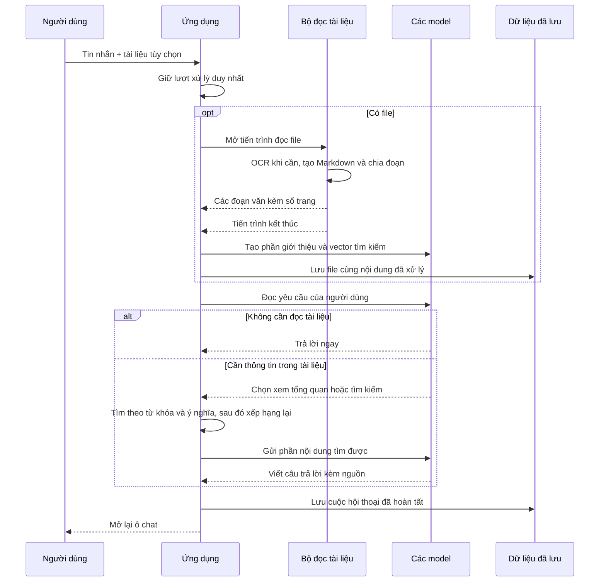

# Local RAG Chatbot

Chatbot RAG dành cho một máy cá nhân có GPU NVIDIA. Project giữ mọi thứ vừa đủ
cho nhu cầu sử dụng cá nhân: dễ cài, dễ theo dõi và không cần thêm dịch vụ ngoài.

## Kiến trúc

Trình duyệt chỉ làm việc với ứng dụng FastAPI. Ứng dụng nhận tin nhắn, quản lý
tài liệu, tìm nội dung liên quan và gửi yêu cầu đến ba model chạy bằng
[llama.cpp](https://github.com/ggml-org/llama.cpp). LLM, embedding và reranker nằm
trong ba Docker container riêng nên có thể khởi động, kiểm tra hoặc thay thế độc
lập.

Bộ đọc tài liệu không chạy thường trực. Khi người dùng tải một file được hỗ trợ
lên, ứng dụng mới mở một tiến trình LiteParse để chuyển đổi định dạng, OCR khi
cần và chia văn bản thành các đoạn nhỏ. Tiến trình này kết thúc ngay sau khi trả
kết quả, nhờ đó tài nguyên được hệ điều hành thu hồi hoàn toàn.



### Luồng upload và chat



LLM tự chọn cách xử lý. Hội thoại thông thường được trả lời ngay. Yêu cầu tóm tắt
hoặc lập dàn ý dùng phần giới thiệu đã lưu của tài liệu. Câu hỏi về dữ kiện cụ thể
sẽ tìm các đoạn liên quan rồi xếp hạng lại trước khi trả cho LLM. Sau khi file đã
sẵn sàng, phần trả lời cần một lượt gọi LLM, hoặc hai lượt nếu phải đọc tài liệu.

Trong lúc xử lý, ô chat được khóa để không có hai yêu cầu cùng sửa dữ liệu. Nút
Stop sẽ dừng phần việc đang chạy; nếu tiến trình đọc file còn hoạt động thì cả
nhóm tiến trình của nó cũng bị kết thúc. File chưa lưu xong sẽ bị bỏ, còn tài liệu
đã hoàn tất trước đó vẫn được giữ nguyên.

Project không cần parser chạy nền thường trực, hàng đợi tác vụ, vector database
hay agent framework. Torch và `llama-cpp-python` cũng không nằm trong ứng dụng
FastAPI.

## Định dạng tài liệu

Allowlist gồm 27 extension, bám theo danh sách được công bố bởi
[LiteParse](https://github.com/run-llama/liteparse). Mọi định dạng đều đi qua cùng
một quy trình Markdown, chunking, embedding và truy vấn RAG.

| Nhóm | Extension | Công cụ chuyển đổi |
| --- | --- | --- |
| PDF | `.pdf` | Đọc trực tiếp |
| Word và văn bản | `.doc`, `.docx`, `.docm`, `.odt`, `.rtf`, `.pages` | LibreOffice |
| Presentation | `.ppt`, `.pptx`, `.pptm`, `.odp`, `.key` | LibreOffice |
| Spreadsheet | `.xls`, `.xlsx`, `.xlsm`, `.ods`, `.csv`, `.tsv`, `.numbers` | LibreOffice |
| Ảnh | `.jpg`, `.jpeg`, `.png`, `.gif`, `.bmp`, `.tiff`, `.webp`, `.svg` | ImageMagick và Tesseract |

Khả năng chuyển đổi thực tế còn phụ thuộc phiên bản LibreOffice/ImageMagick và
nội dung file. Nếu converter hoặc parser thất bại, request trả lỗi và không ghi
file, corpus hay index dở dang. Giới hạn mặc định là 25 MiB mỗi upload và 200
trang sau chuyển đổi. Parser bị dừng tự động sau 5 phút nếu converter hoặc OCR
không kết thúc; tin nhắn chat được giới hạn ở 12.000 ký tự.

## Cấu trúc source

| Module | Trách nhiệm |
| --- | --- |
| [`src/config.py`](src/config.py) | Khai báo endpoint model, đường dẫn dữ liệu, resource limit và allowlist định dạng. |
| [`src/models.py`](src/models.py) | Định nghĩa DTO, validate quan hệ giữa dữ liệu và đọc/ghi JSON atomic. |
| [`src/llama.py`](src/llama.py) | HTTP client đã validate cho LLM, embedding và reranker llama.cpp. |
| [`src/rag.py`](src/rag.py) | Giữ index trong RAM; chạy BM25, semantic search, RRF và reranking. |
| [`src/parse_worker.py`](src/parse_worker.py) | CLI worker dùng LiteParse, OCR, Markdown splitter và tạo citation theo trang. |
| [`src/documents.py`](src/documents.py) | Điều phối upload, parser process group, overview và transaction corpus/index. |
| [`src/chat.py`](src/chat.py) | Xây prompt, thực thi agent một tool và chỉ lưu câu trả lời hoàn chỉnh. |
| [`src/main.py`](src/main.py) | Khởi tạo service, quản lý một request đang chạy và cung cấp FastAPI/SSE API. |
| [`src/templates/index.html`](src/templates/index.html) | Cấu trúc giao diện chat và document sidebar. |
| [`src/static/script.js`](src/static/script.js) | Gửi request, đọc SSE, stop, download, delete và cập nhật UI. |
| [`src/static/style.css`](src/static/style.css) | Layout, theme, responsive style và trạng thái giao diện. |

`main.py` là composition root: module này tạo và nối các service khi ứng dụng
khởi động. `parse_worker.py` là entrypoint riêng, chỉ tồn tại trong thời gian xử
lý một upload. Các model không được import vào Python process mà luôn được gọi
qua HTTP.

## Mô hình dữ liệu

Các DTO persisted nằm trong `models.py` và tự validate khi được tạo hoặc đọc từ
JSON.

| Dataclass | Dữ liệu đại diện | Bất biến chính |
| --- | --- | --- |
| `Chunk` | Một đoạn có `file_id`, `chunk_id`, nội dung và page refs. | ID hợp lệ, text không rỗng và refs là chuỗi hợp lệ. |
| `Document` | Metadata, overview và số chunk của một file. | `chunk_count` không âm và phải khớp corpus. |
| `Message` | Tin nhắn `user` hoặc `assistant`. | Không lưu system prompt, tool call hoặc tool result. |
| `Corpus` | Snapshot của toàn bộ documents và chunks. | Không trùng ID; chunk phải thuộc đúng document và filename. |
| `History` | Snapshot lịch sử chat đã hoàn tất. | Chỉ chứa `Message` hợp lệ. |

Các dataclass runtime không được persist:

- `ContentEvent` và `ToolCallEvent`: event đã validate từ LLM stream;
- `LiveCorpus` và `LiveHistory`: holder để các service cùng thấy snapshot mới;
- `RequestState`: cancellation event, asyncio task và parser process hiện tại;
- `ApplicationRuntime`: toàn bộ service cùng single-request lock của ứng dụng.

## API

| Method và path | Chức năng | Kết quả |
| --- | --- | --- |
| `GET /` | Mở giao diện web. | HTML application. |
| `POST /api/chat` | Nhận `message` và một `file` tùy chọn. | SSE gồm request ID, status, content và event kết thúc. |
| `POST /api/stop` | Hủy chat hoặc upload đang chạy. | Trạng thái có request thực sự bị hủy hay không. |
| `GET /api/chat-history` | Đọc lịch sử đã persist. | Danh sách user/assistant messages. |
| `POST /api/clear-chat` | Hủy request rồi xóa history và toàn bộ tài liệu. | Status JSON. |
| `GET /api/documents` | Liệt kê tài liệu đã commit. | File ID, filename và chunk count. |
| `DELETE /api/documents/{file_id}` | Xóa một tài liệu khi hệ thống đang rảnh. | `200`, `404` hoặc `409`. |
| `GET /api/documents/{file_id}/download` | Tải lại file gốc. | File response giữ filename ban đầu. |

`POST /api/chat` là endpoint duy nhất giữ request slot trong thời gian dài. Thứ
tự SSE thông thường là `request_id`, trạng thái xử lý file, trạng thái tạo câu
trả lời, các mảnh content và `done`. Comment heartbeat được gửi khi model hoặc
parser chưa có kết quả mới.

## Các cơ chế chính

### Transaction tài liệu

Upload được ghi vào staging trước. Parser, overview và embedding phải hoàn tất
thì service mới chuẩn bị corpus/index mới, chuyển file vào `uploads/` và atomic
replace corpus JSON. Index trong RAM chỉ được install sau khi dữ liệu bền vững đã
ghi thành công. Xóa tài liệu dùng cùng nguyên tắc và có thể chuyển file trở lại
nếu lưu corpus thất bại.

### Hybrid RAG

BM25 tìm theo từ khóa; embedding tìm theo ý nghĩa. Reciprocal Rank Fusion gộp
hai bảng xếp hạng mà không cộng trực tiếp hai loại điểm khác thang đo. Candidate
sau đó được reranker chấm lại và chỉ các chunk tốt nhất mới đến LLM. Vector index
không được persist: ứng dụng rebuild embedding từ corpus khi khởi động.

### Agent loop

Lượt LLM đầu có thể trả lời trực tiếp hoặc chọn đúng một trong hai thao tác:

- lấy overview cho tóm tắt, dàn ý và so sánh khái quát;
- search chunks cho dữ kiện chi tiết và citation.

Nếu có tool call, kết quả chỉ tồn tại trong request hiện tại và được gửi vào lượt
LLM cuối. Agent không cho phép trộn content với tool call, gọi nhiều tool hoặc gọi
tool lần hai. History chỉ được persist sau khi câu trả lời cuối đã stream thành
công.

### Cancellation và request lock

Một FastAPI process chỉ nhận một pipeline chat/upload tại một thời điểm. Stop và
client disconnect cùng kích hoạt cancellation. Với parser, service gửi `SIGTERM`
cho toàn process group, chờ grace period rồi dùng `SIGKILL` nếu cần; process luôn
được reap trước khi request kết thúc.

## Phần cứng và nền tảng

Cấu hình tối thiểu mục tiêu:

- GPU NVIDIA có ít nhất **6 GB VRAM**;
- GPU có Tensor Core, khuyến nghị kiến trúc **Turing trở lên**;
- NVIDIA driver hỗ trợ **CUDA 13.0 trở lên**, kiểm tra bằng `nvidia-smi`;
- RAM hệ thống từ 16 GB;
- Python 3.12, [uv](https://docs.astral.sh/uv/), Docker Engine và Docker Compose.

Các tham số CUDA, Flash Attention, KV cache và MTP trong
[`docker-compose.yaml`](docker-compose.yaml) được tối ưu và kiểm thử trên GPU có
Tensor Core. Host không cần cài CUDA Toolkit; CUDA runtime nằm trong image
`ghcr.io/ggml-org/llama.cpp:server-cuda13`, còn driver host phải đủ mới để chạy
runtime đó.

Cấu hình tham chiếu đã kiểm thử bằng `inxi` và `nvidia-smi`:

- Fedora Linux 44 Workstation, kernel 7.1;
- Lenovo LOQ 15IRH8, Intel Core i5-13420H, RAM 16 GB;
- GeForce RTX 4050 Laptop GPU, 6141 MiB VRAM;
- NVIDIA driver 610.43.03, CUDA UMD 13.3.

### Linux

Cần [Docker Engine](https://docs.docker.com/engine/install/), NVIDIA driver và
[NVIDIA Container Toolkit](https://github.com/NVIDIA/nvidia-container-toolkit).
Không cần cài CUDA Toolkit trên host.

### Windows

Dùng Windows 10/11, WSL2 và Docker Desktop với WSL2 backend. Cài driver mới qua
[NVIDIA App](https://www.nvidia.com/en-us/software/nvidia-app/) rồi bật GPU support
trong [Docker Desktop](https://docs.docker.com/desktop/features/gpu/). Docker
Desktop cung cấp đường GPU vào Linux container qua WSL2; không cài riêng NVIDIA
Container Toolkit trong Windows.

## Model

Đặt bốn file sau trong `models/`:

| Vai trò | Hugging Face repository | File |
| --- | --- | --- |
| LLM QAT 4-bit | [`unsloth/gemma-4-E4B-it-qat-GGUF`](https://huggingface.co/unsloth/gemma-4-E4B-it-qat-GGUF) | `gemma-4-E4B-it-qat-UD-Q4_K_XL.gguf` |
| MTP drafter | cùng repository LLM | `mtp-gemma-4-E4B-it.gguf` |
| Embedding | [`gpustack/bge-m3-GGUF`](https://huggingface.co/gpustack/bge-m3-GGUF) | `bge-m3-Q8_0.gguf` |
| Reranker | [`gpustack/bge-reranker-v2-m3-GGUF`](https://huggingface.co/gpustack/bge-reranker-v2-m3-GGUF) | `bge-reranker-v2-m3-Q8_0.gguf` |

## Cài đặt

Các dependency hệ thống phục vụ chuyển đổi office document, render ảnh và OCR:

- [Tesseract OCR](https://github.com/tesseract-ocr/tesseract);
- [LibreOffice](https://github.com/LibreOffice/core);
- [ImageMagick](https://github.com/ImageMagick/ImageMagick).

Fedora/RHEL:

```bash
sudo dnf install -y tesseract tesseract-langpack-eng tesseract-langpack-vie libreoffice ImageMagick
```

Debian/Ubuntu:

```bash
sudo apt update
sudo apt install -y tesseract-ocr tesseract-ocr-eng tesseract-ocr-vie libreoffice imagemagick
```

Python và tokenizer:

```bash
uv sync --group dev
uv run python -c "from tokenizers import Tokenizer; Tokenizer.from_pretrained('BAAI/bge-m3')"
```

Model services:

```bash
docker compose up -d
curl -fsS http://127.0.0.1:8080/health
curl -fsS http://127.0.0.1:8081/health
curl -fsS http://127.0.0.1:8082/health
```

Application:

```bash
uv run python -m src.main
```

File upload, corpus đã xử lý và lịch sử chat được lưu trong `data/`. Git chỉ giữ
`data/.gitkeep`; toàn bộ dữ liệu runtime bên trong thư mục này được ignore.

## Kiểm thử

```bash
uv run pytest -q
RUN_LIVE_MODEL_TEST=1 uv run pytest tests/test_agent_eval.py -m live_model -v -s
```
