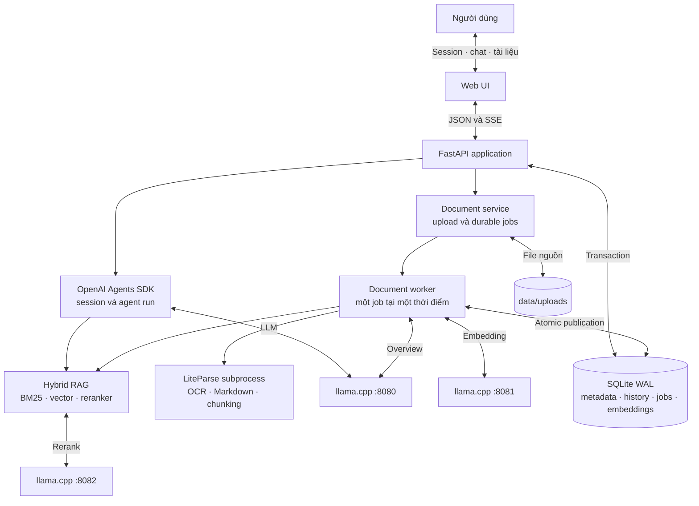
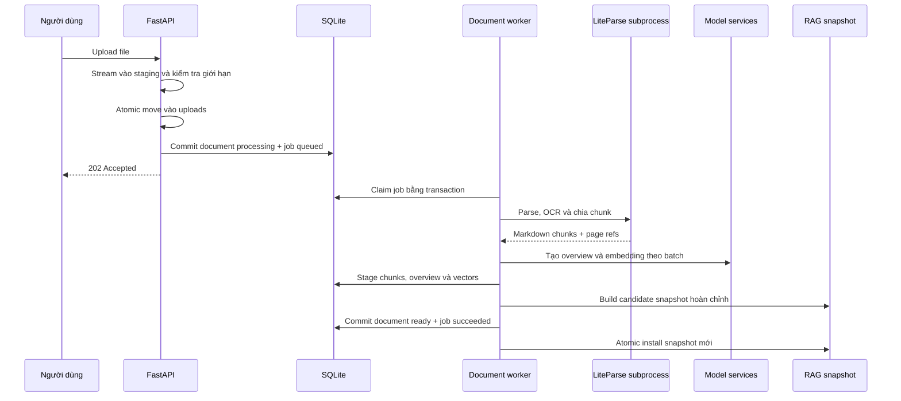
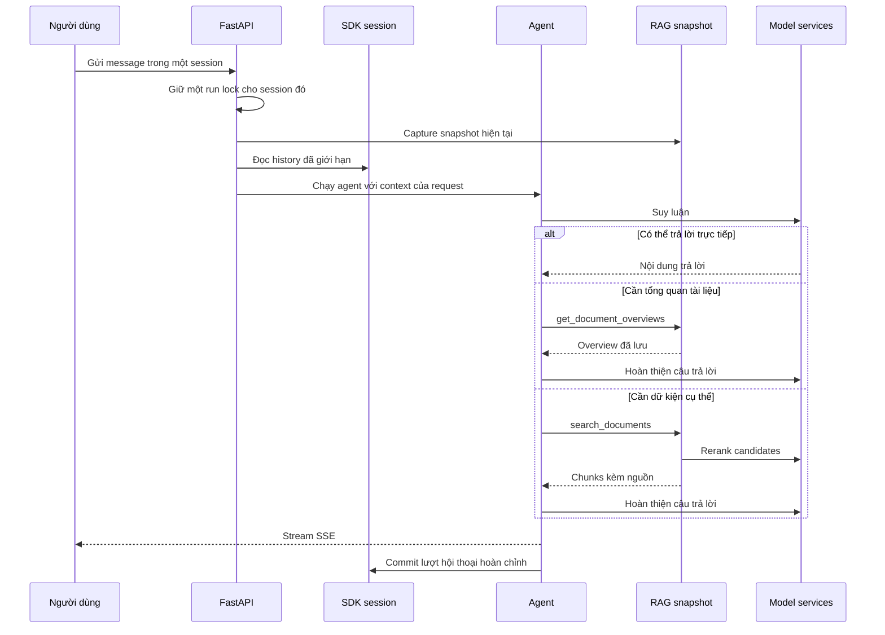

# Local RAG Chatbot

Chatbot RAG dành cho một người dùng trên máy cá nhân có GPU NVIDIA. Project ưu
tiên bốn thuộc tính: dữ liệu nằm tại máy, nhiều cuộc trò chuyện độc lập, tài liệu
dùng chung giữa mọi session và các tác vụ dài không chặn giao diện.

Hệ thống chỉ gồm một ứng dụng FastAPI, một SQLite database và ba model service
chạy bằng llama.cpp. Không cần vector database, message broker, parser daemon hay
dịch vụ cloud.

## Kiến trúc

Trình duyệt chia giao diện thành ba vùng: session ở bên trái, chat ở giữa và tài
liệu dùng chung ở bên phải. Upload/download/xóa tài liệu độc lập với gửi tin nhắn;
người dùng có thể tiếp tục chat trong khi một file đang được xử lý.

FastAPI quản lý API, session và các giới hạn đồng thời. OpenAI Agents SDK điều
phối LLM cùng hai RAG tool chỉ-đọc. SQLite là nguồn dữ liệu có thẩm quyền cho
session, lịch sử agent, document, chunk, embedding và hàng đợi ingestion. Một
snapshot RAG bất biến trong RAM phục vụ truy vấn mà không giữ transaction database
trong suốt một lượt chat.


```mermaid
flowchart TB
    User[Người dùng] <-->|Session · chat · tài liệu| Web[Web UI]
    Web <-->|JSON và SSE| App[FastAPI application]

    App --> Agent[OpenAI Agents SDK<br/>session và agent run]
    App --> Docs[Document service<br/>upload và durable jobs]
    Agent --> Rag[Hybrid RAG<br/>BM25 · vector · reranker]
    Docs --> Worker[Document worker<br/>một job tại một thời điểm]
    Worker --> Parser[LiteParse subprocess<br/>OCR · Markdown · chunking]

    Agent <-->|LLM| LLM[llama.cpp :8080]
    Worker <-->|Overview| LLM
    Worker <-->|Embedding| Embed[llama.cpp :8081]
    Rag <-->|Rerank| Rerank[llama.cpp :8082]

    App <-->|Transaction| DB[(SQLite WAL<br/>metadata · history · jobs · embeddings)]
    Worker <-->|Atomic publication| DB
    Docs <-->|File nguồn| Files[(data/uploads)]
    Worker --> Rag
```

Ứng dụng chạy đúng **một ASGI worker**. Đây là chủ ý: document worker và snapshot
RAG sống trong process FastAPI. Đồng thời bên trong process vẫn là async thực sự,
được giới hạn riêng theo từng tài nguyên thay vì khóa toàn ứng dụng.

## Luồng dữ liệu

### Upload và ingestion


```mermaid
sequenceDiagram
    participant U as Người dùng
    participant A as FastAPI
    participant D as SQLite
    participant W as Document worker
    participant P as LiteParse subprocess
    participant M as Model services
    participant R as RAG snapshot

    U->>A: Upload file
    A->>A: Stream vào staging và kiểm tra giới hạn
    A->>A: Atomic move vào uploads
    A->>D: Commit document processing + job queued
    A-->>U: 202 Accepted

    W->>D: Claim job bằng transaction
    W->>P: Parse, OCR và chia chunk
    P-->>W: Markdown chunks + page refs
    W->>M: Tạo overview và embedding theo batch
    W->>D: Stage chunks, overview và vectors
    W->>R: Build candidate snapshot hoàn chỉnh
    W->>D: Commit document ready + job succeeded
    W->>R: Atomic install snapshot mới
```

Request upload kết thúc ngay khi file và job đã bền vững. Nếu ứng dụng dừng giữa
chừng, job `running` được đưa lại về `queued` khi khởi động. Job lỗi được retry có
giới hạn; lỗi cuối cùng được lưu ở document để giao diện hiển thị và cho phép retry
thủ công.

Document chỉ chuyển sang `ready` khi chunks, embedding và snapshot tìm kiếm đều
hoàn chỉnh. Vì publication diễn ra dưới một lock ngắn, không có trạng thái file
đã sẵn sàng nhưng chưa thể tìm thấy.

### Chat và RAG


```mermaid
sequenceDiagram
    participant U as Người dùng
    participant A as FastAPI
    participant S as SDK session
    participant G as Agent
    participant R as RAG snapshot
    participant M as Model services

    U->>A: Gửi message trong một session
    A->>A: Giữ một run lock cho session đó
    A->>R: Capture snapshot hiện tại
    A->>S: Đọc history đã giới hạn
    A->>G: Chạy agent với context của request
    G->>M: Suy luận
    alt Có thể trả lời trực tiếp
        M-->>G: Nội dung trả lời
    else Cần tổng quan tài liệu
        G->>R: get_document_overviews
        R-->>G: Overview đã lưu
        G->>M: Hoàn thiện câu trả lời
    else Cần dữ kiện cụ thể
        G->>R: search_documents
        R->>M: Rerank candidates
        R-->>G: Chunks kèm nguồn
        G->>M: Hoàn thiện câu trả lời
    end
    G-->>U: Stream SSE
    G->>S: Commit lượt hội thoại hoàn chỉnh
```

Mỗi session chỉ có một agent run tại một thời điểm để giữ thứ tự lịch sử. Các
session khác nhau có thể chạy đồng thời trong giới hạn LLM chung. Stop chỉ hủy run
của session được chọn; tài liệu và các session khác không bị ảnh hưởng.

Mỗi run giữ nguyên snapshot đã capture. Vì vậy publication hoặc xóa tài liệu
không làm thay đổi tập dữ liệu giữa một câu trả lời. Một truy vấn đang chạy có thể
hoàn tất trên snapshot cũ; truy vấn bắt đầu sau publication dùng snapshot mới.

### Xóa tài liệu

Xóa cũng là một durable job. API đánh dấu document là `deleting`, hủy các job
ingest/reindex chưa chạy và trả `202`. Worker dựng snapshot không chứa document,
xóa metadata/chunks bằng transaction, cài snapshot mới rồi xóa file nguồn. Cách
này giữ database và index trong RAM nhất quán ngay cả khi process bị dừng.

## Agent và Hybrid RAG

Agent có một định nghĩa ổn định, instruction động theo snapshot và hai tool:

- `get_document_overviews`: dùng cho tóm tắt, dàn ý và so sánh khái quát;
- `search_documents`: dùng cho dữ kiện chi tiết và citation.

Tool chỉ đọc context của run, không thay đổi session hay document. OpenAI Agents
SDK đảm nhiệm agent loop, tool lifecycle, streaming và session protocol; model
vẫn là llama.cpp cục bộ qua Responses-compatible API.

Tìm kiếm kết hợp ba bước:

1. BM25 lấy candidate theo từ khóa;
2. cosine similarity lấy candidate theo ngữ nghĩa;
3. Reciprocal Rank Fusion gộp hai danh sách, sau đó reranker chọn tối đa 5 chunk.

Embedding được lưu trong SQLite nên khởi động lại chỉ rebuild cấu trúc tìm kiếm
trong RAM, không gọi model lại. Thay `EMBEDDING_SIGNATURE` sẽ lên lịch reindex các
document có vector không còn tương thích.

History của từng session cũng nằm trong SQLite qua SDK. Model chỉ nhận tối đa 48
raw item, 12 message hoàn chỉnh và 12.000 ký tự gần nhất; dữ liệu cũ hơn vẫn được
lưu để giao diện đọc lại. Việc giới hạn diễn ra ở input của model, không cắt mất
lịch sử đã persist.

## Độ bền và đồng thời

SQLite chạy WAL, foreign keys và transaction ghi tuần tự. Các thao tác SQLite,
BM25, chuẩn bị vector và công việc CPU đều chạy ngoài event loop.

Giới hạn mặc định phản ánh tài nguyên của một máy cá nhân:

| Tài nguyên | Giới hạn |
| --- | ---: |
| Agent/LLM run giữa các session | 4 |
| Run trong cùng một session | 1 |
| Document job đang xử lý | 1 |
| LiteParse subprocess | 1 |
| Embedding request | 1 |
| Rerank request | 1 |
| RAG CPU worker | 2 |

Parser là subprocess dùng một lần và có thể hủy toàn bộ process group. Giới hạn
mặc định là 25 MiB mỗi upload, 200 trang, 300 giây parse và 1.024 token mỗi chunk.
Overview dùng tối đa 48.000 ký tự đầu của tài liệu. Chat input tối đa 12.000 ký tự.

## Định dạng tài liệu

Allowlist bám theo các định dạng LiteParse hỗ trợ. LibreOffice là dependency bắt
buộc để chuyển đổi tài liệu Office; ảnh có thể cần ImageMagick và Tesseract OCR.

| Nhóm | Extension |
| --- | --- |
| PDF | `.pdf` |
| Text | `.txt`, `.md`, `.markdown`, `.log` |
| Word | `.doc`, `.docx`, `.docm`, `.dot`, `.dotx`, `.dotm`, `.odt`, `.ott`, `.rtf`, `.pages` |
| Presentation | `.ppt`, `.pptx`, `.pptm`, `.pot`, `.potx`, `.potm`, `.odp`, `.otp`, `.key` |
| Spreadsheet | `.xls`, `.xlsx`, `.xlsm`, `.xlsb`, `.ods`, `.ots`, `.csv`, `.tsv`, `.numbers` |
| Image | `.jpg`, `.jpeg`, `.png`, `.gif`, `.bmp`, `.tif`, `.tiff`, `.webp`, `.svg` |

Mọi định dạng đều đi qua cùng một output Markdown, chunking, embedding và truy
vấn RAG. Filename, extension, media type, kích thước và kết quả parser đều được
validate trước khi publication.

## Cấu trúc source

| Module | Trách nhiệm |
| --- | --- |
| [`src/main.py`](src/main.py) | Composition root, lifespan, FastAPI routes và SSE transport. |
| [`src/config.py`](src/config.py) | Endpoint, đường dẫn, allowlist và resource budgets. |
| [`src/database.py`](src/database.py) | SQLite schema, WAL và transaction chạy ngoài event loop. |
| [`src/models.py`](src/models.py) | DTO cùng validation cho document, chunk, job, session và message. |
| [`src/sessions.py`](src/sessions.py) | Session metadata, SDK SQLiteSession và history window. |
| [`src/agent.py`](src/agent.py) | Agent definition, RAG tools, run lifecycle, SSE event và cancellation. |
| [`src/model_clients.py`](src/model_clients.py) | HTTP client cho LLM, overview, embedding và reranker. |
| [`src/documents.py`](src/documents.py) | Upload/download, document lifecycle và durable job scheduling. |
| [`src/jobs.py`](src/jobs.py) | Claim/retry/recover job và atomic RAG publication. |
| [`src/parser.py`](src/parser.py) | Quản lý, timeout và hủy LiteParse subprocess. |
| [`src/parse_worker.py`](src/parse_worker.py) | CLI worker cho OCR, Markdown và token-aware chunking. |
| [`src/rag.py`](src/rag.py) | Immutable snapshot, BM25, vector search, RRF và reranking. |
| [`src/migration.py`](src/migration.py) | Import dữ liệu JSON của phiên bản cũ vào SQLite một lần. |
| [`src/templates/index.html`](src/templates/index.html) | Cấu trúc giao diện ba vùng. |
| [`src/static/script.js`](src/static/script.js) | Session/document API, SSE và UI state. |
| [`src/static/style.css`](src/static/style.css) | Responsive layout, light/dark theme và component style. |

`main.py` chỉ nối các service và quản lý lifespan. Model không được import vào
Python process; mọi suy luận đi qua HTTP. Parser chỉ tồn tại trong thời gian xử lý
một document, còn document worker là task nền duy nhất của ứng dụng.

## Mô hình dữ liệu

`data/app.sqlite3` là nguồn dữ liệu có thẩm quyền:

| Thành phần | Nội dung | Bất biến chính |
| --- | --- | --- |
| `sessions` | ID, title và timestamps. | ID ổn định; title được giới hạn và validate. |
| SDK session tables | User/assistant/tool items theo session. | Chỉ commit lượt agent hoàn chỉnh. |
| `documents` | Filename, media type, status, overview và chunk count. | Status thuộc `processing`, `ready`, `failed`, `deleting`. |
| `chunks` | Text, page refs và embedding blob. | Chunk thuộc đúng document; embedding cùng dimension. |
| `document_jobs` | Ingest, reindex hoặc delete cùng trạng thái retry. | Claim bằng transaction; không mất job khi restart. |

File nguồn nằm tại `data/uploads/<document-id>`; `data/staging` chỉ chứa file tạm
theo request. Lần khởi động đầu tiên có thể import không phá hủy
`data/corpus/corpus.json` và `data/history/chat_history.json`; runtime mới không
ghi lại hai file JSON đó.

## API

| Method và path | Chức năng |
| --- | --- |
| `GET /` | Mở web UI. |
| `POST /api/sessions` | Tạo session. |
| `GET /api/sessions` | Liệt kê session theo thời gian cập nhật. |
| `PATCH /api/sessions/{id}` | Đổi tên session. |
| `GET /api/sessions/{id}/messages` | Đọc lịch sử hiển thị. |
| `DELETE /api/sessions/{id}` | Xóa session và history của nó. |
| `POST /api/sessions/{id}/chat` | Stream một agent run bằng SSE. |
| `POST /api/sessions/{id}/stop` | Hủy run đang hoạt động của session. |
| `POST /api/documents` | Upload file và trả `202` sau durable enqueue. |
| `GET /api/documents` | Liệt kê tài liệu và trạng thái xử lý. |
| `GET /api/documents/{id}/download` | Tải file nguồn. |
| `POST /api/documents/{id}/retry` | Chạy lại document đã failed. |
| `DELETE /api/documents/{id}` | Lên lịch xóa và trả `202`. |

## Phần cứng và nền tảng

Cấu hình tối thiểu mục tiêu:

- GPU NVIDIA có ít nhất **6 GB VRAM**;
- GPU có Tensor Core, khuyến nghị kiến trúc **Turing trở lên**;
- NVIDIA driver hỗ trợ CUDA runtime của image llama.cpp;
- RAM hệ thống từ 16 GB;
- Python 3.12, [uv](https://docs.astral.sh/uv/), Docker Engine và Docker Compose.

Các tham số CUDA, Flash Attention, KV cache và MTP trong
[`docker-compose.yaml`](docker-compose.yaml) được tối ưu cho GPU có Tensor Core.
Host không cần CUDA Toolkit; CUDA runtime nằm trong container, còn driver host
phải đủ mới để chạy runtime đó.

### Linux

Cần [Docker Engine](https://docs.docker.com/engine/install/), NVIDIA driver và
[NVIDIA Container Toolkit](https://github.com/NVIDIA/nvidia-container-toolkit).

### Windows

Dùng Windows 10/11, WSL2 và Docker Desktop với WSL2 backend. Cài NVIDIA driver
trên Windows và bật GPU support của Docker Desktop; không cài riêng NVIDIA
Container Toolkit bên trong Windows.

## Model

Đặt bốn file sau trong `models/`:

| Vai trò | Hugging Face repository | File |
| --- | --- | --- |
| LLM QAT 4-bit | [`unsloth/gemma-4-E4B-it-qat-GGUF`](https://huggingface.co/unsloth/gemma-4-E4B-it-qat-GGUF) | `gemma-4-E4B-it-qat-UD-Q4_K_XL.gguf` |
| MTP drafter | cùng repository LLM | `mtp-gemma-4-E4B-it.gguf` |
| Embedding | [`gpustack/bge-m3-GGUF`](https://huggingface.co/gpustack/bge-m3-GGUF) | `bge-m3-Q8_0.gguf` |
| Reranker | [`gpustack/bge-reranker-v2-m3-GGUF`](https://huggingface.co/gpustack/bge-reranker-v2-m3-GGUF) | `bge-reranker-v2-m3-Q8_0.gguf` |

## Cài đặt và chạy

Dependency hệ thống:

- [LibreOffice](https://github.com/LibreOffice/core) cho tài liệu Office;
- [Tesseract OCR](https://github.com/tesseract-ocr/tesseract) cho ảnh scan;
- [ImageMagick](https://github.com/ImageMagick/ImageMagick) cho chuyển đổi ảnh.

Fedora/RHEL:

```bash
sudo dnf install -y libreoffice ImageMagick tesseract tesseract-langpack-eng tesseract-langpack-vie
```

Debian/Ubuntu:

```bash
sudo apt update
sudo apt install -y libreoffice imagemagick tesseract-ocr tesseract-ocr-eng tesseract-ocr-vie
```

Cài Python dependency và tokenizer:

```bash
uv sync --group dev
uv run python -c "from tokenizers import Tokenizer; Tokenizer.from_pretrained('BAAI/bge-m3')"
```

Khởi động model services:

```bash
docker compose up -d
curl -fsS http://127.0.0.1:8080/health
curl -fsS http://127.0.0.1:8081/health
curl -fsS http://127.0.0.1:8082/health
```

Khởi động ứng dụng:

```bash
uv run uvicorn src.main:app --host 127.0.0.1 --port 8000 --workers 1
```

Mở <http://127.0.0.1:8000>. Có thể thay endpoint bằng `LLM_URL`, `EMBED_URL` và
`RERANK_URL`. Toàn bộ dữ liệu runtime trong `data/` và model trong `models/` được
Git ignore.

## Kiểm thử

```bash
uv run pytest -q
RUN_LIVE_MODEL_TESTS=1 uv run pytest -m live_model -q
RUN_PARSE_INTEGRATION=1 uv run pytest -m parse_integration -q
```

Hai suite opt-in cần model services hoặc LibreOffice/LiteParse trên máy. Test mặc
định dùng fake xác định và không cần Docker hay model.
